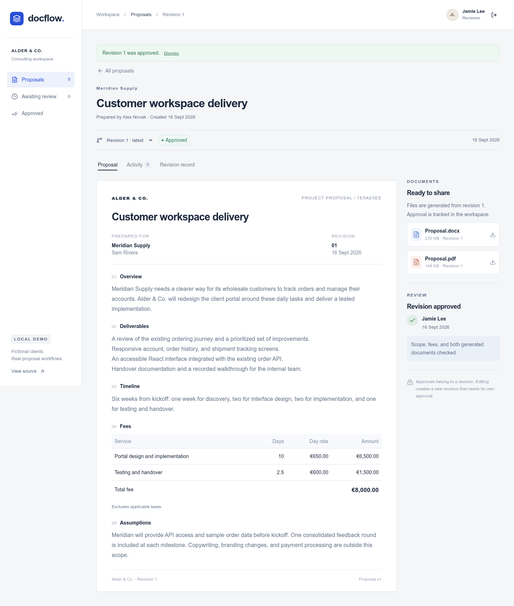

# DocFlow

[](https://github.com/MilanG-Ne/docflow/actions/workflows/ci.yml)

A working proposal workflow for a fictional consultancy. An author writes the scope and fees, a background worker generates Word and PDF documents, and an independent reviewer approves one exact revision.

**Changing an approved proposal creates a new draft.** The earlier approval, content, and downloadable files stay together in the revision history.



## Try it locally

Requires Docker with the Compose plugin. No API keys or cloud accounts are needed.

```sh
git clone https://github.com/MilanG-Ne/docflow.git
cd docflow
docker compose up --build --wait --wait-timeout 150
```

Open **[localhost:8000](http://localhost:8000)**. The first build downloads the runtime and LibreOffice, so it takes longer than subsequent starts. The two example proposals finish generating shortly after the workspace starts.

1. Choose **Author**, then **Open workspace**.
2. Open a proposal or create one. Download its generated Word and PDF files.
3. Select **Send for review** once generation finishes.
4. Sign out, choose **Reviewer**, open the proposal, and add review notes. Approve it or request changes.
5. Return as Author and create a **New revision**. Use the revision selector to compare the new draft with the earlier decision and files.

| Demo account | Email | Password |
| --- | --- | --- |
| Alex Novak · author | `alex@alder.example` | `proposal-demo-2026` |
| Jamie Lee · reviewer | `jamie@alder.example` | `proposal-demo-2026` |

These are intentionally public, fictional accounts. Compose binds the app to `127.0.0.1`; PostgreSQL has no published port. The demo runs on your computer and uses no paid APIs or hosted database. Normal local CPU, disk, and download usage still apply.

Stop it with `docker compose down`. Your proposals and files remain in named volumes. To **delete all local demo data** and start fresh, use `docker compose down --volumes`.

## What it demonstrates

- **A real document pipeline:** structured input, a versioned OOXML template, repeating fee rows, optional sections, strict template validation, and headless PDF conversion.
- **Revision-specific approval:** immutable content snapshots, content/template/file hashes, independent review, stale-edit protection, and retained history.
- **Durable background work:** database-backed jobs, concurrent worker claims, expiring leases, bounded retries, and fenced publication of generated files.
- **A usable React interface:** author/reviewer views, an editable fee schedule, search and filters, generation states, feedback, revision navigation, and responsive layouts.
- **Reproducible integration checks:** PostgreSQL concurrency tests, actual LibreOffice conversion, and a complete Docker lifecycle exercised over HTTP in CI.

The backend uses Python, FastAPI, SQLAlchemy, Alembic, and PostgreSQL. The interface uses React, TypeScript, Base UI/shadcn components, and Vinext to build static assets served by FastAPI. Document generation uses docxtpl and LibreOffice. There is no external AI service in the application.

## Generated examples

The checked-in sample was generated and approved through the application using fictional content:

- [Word proposal](examples/generated/approved-proposal.docx)
- [PDF proposal](examples/generated/approved-proposal.pdf)
- [Approval record with SHA-256 hashes](examples/generated/approval-record.json)

Approval is recorded in the workspace. The documents are generated before review and are not rewritten or stamped afterward. These records are application checks, not electronic signatures or a tamper-proof external audit.

## Run the checks

With the local Docker demo running:

```sh
python3 scripts/smoke.py
```

This creates a proposal, waits for conversion, checks the downloads against the approval hashes, creates a new draft, and verifies that the original approved files are unchanged. It leaves its example proposal in the local database.

For the containerized backend suite, including actual document conversion:

```sh
docker build --target test -t docflow-tests .
docker run --rm docflow-tests sh -c 'python -m ruff check . && python -m pytest -q'
```

PostgreSQL concurrency tests require a separate test database and otherwise skip. CI supplies one and also verifies migrations. See [development and configuration](docs/development.md) for frontend checks and running without Docker.

## Design notes

- [Architecture and tradeoffs](docs/architecture.md)
- [Development, configuration, and troubleshooting](docs/development.md)
- [Verification and known limits](docs/verification.md)
- [Contributing](CONTRIBUTING.md)
- [Third-party notices](THIRD_PARTY_NOTICES.md)

This is a local portfolio demo with trusted, bundled templates. Public deployment would need its own authentication provisioning, rate limits, HTTPS configuration, backups, and operational review. See the documented limits before adapting it for real client data.

Built by [Milan Georgijevic](https://github.com/MilanG-Ne). Project code is available under the [MIT license](LICENSE).
