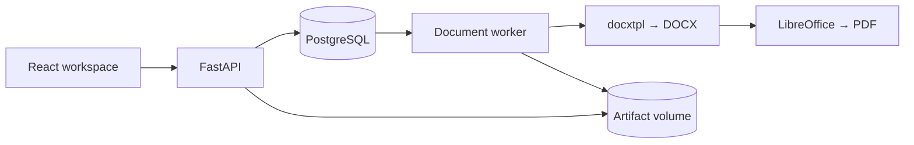

# Architecture

## The approval boundary

A proposal is a stable identifier with an owner and a latest revision number. Every revision stores a validated content snapshot, its SHA-256 fingerprint, and the hash of the template used to generate its documents. Content is never updated through the API after creation.

Saving commits the revision and its pending job in one database transaction. The worker reads the same persisted snapshot as the reviewer. Once both files exist, the author can submit the latest draft for review. A reviewer can approve it or request changes, and must supply the content hash currently being reviewed.

Approval verifies the actual files on disk, then records their hashes alongside the revision's content hash and the reviewer's decision. Downloads verify the stored hash again. A missing file returns `410`; a changed file returns `409`. This catches accidental file replacement within the application. An administrator who can rewrite the database and files can also rewrite these records.

An edit always creates a new draft and job. Old revisions remain downloadable; an earlier approval does not approve the new draft. Review decisions are final for their revision, including requests for changes. The author addresses feedback by creating another revision.

## Competing requests

Revision creation, submission, and review serialize on the proposal row. A no-op `UPDATE … RETURNING` obtains a write lock on both PostgreSQL and the SQLite development path. An edit also supplies `expected_number`, so two writers cannot silently produce competing versions of the same next revision.

If approval wins a race with an edit, it approves the previous revision and the edit creates a new draft. If the edit wins, the old revision can no longer be approved. The new revision is never approved by the old request. PostgreSQL integration tests exercise both this boundary and concurrent worker claims.

## Why the queue lives in PostgreSQL

The workload is small and each job belongs to a database revision. Keeping the queue in the same database makes creation atomic without introducing a broker or a second persistence system. It is intentionally a polling queue, not a general-purpose workflow engine.

Workers claim eligible jobs with `FOR UPDATE SKIP LOCKED` and a conditional update. Each claim receives a unique token and a 120-second lease. LibreOffice conversion has a 60-second timeout. A worker that loses its lease cannot publish over a newer claim: publication checks the token inside a transaction.

Each attempt writes into its own directory. Only the winning attempt is referenced by artifact rows. Transient failures retry up to three attempts, with delays of two and four seconds. Invalid templates fail immediately. An expired final attempt becomes failed instead of remaining stuck. The author can explicitly retry a failed latest draft; a template mismatch requires a new revision.

Graceful shutdown lets the current conversion finish. Hard process termination can leave unreferenced attempt directories; there is no scheduled garbage collector in this version. Back up the database and artifact volume together. A database backup without the corresponding files cannot restore downloads.

## Documents and money

`backend/docflow/templates/proposal-v1.docx` is a bundled, trusted template. docxtpl receives a sandboxed Jinja environment with strict undefined-variable checks and XML escaping. The renderer checks the package structure and bounds its uncompressed size. Each LibreOffice conversion uses an isolated temporary profile.

The template supports repeated fee rows and an optional assumptions section. Template tags must stay in the runs/rows expected by docxtpl. Update tests and render the generated pages when editing it. A template's hash is pinned when a revision is created; changing the template does not silently regenerate an existing revision.

Rates are integer cents. Quantities have at most two decimal places. The backend multiplies with `Decimal`, rounds each line half up to cents, and then adds the lines. The frontend uses integer hundredths for the same rule; for example, `1.15` days at `€0.50` produces `€0.58`. Totals exclude taxes.

## Session and permission model

Passwords are Argon2-hashed. Random session tokens are stored only as SHA-256 digests, expire after eight hours, and are sent in HTTP-only SameSite cookies. Mutations require the session's CSRF token. Browser requests with an unexpected Origin are rejected. Responses disable framing and sniffing; authenticated API responses are not cached.

Authors see and edit their own proposals. Reviewers can read proposals and make review decisions, but cannot edit content or approve their own work. All checks occur in the API. The frontend is not a permission boundary.

The two demo accounts are seeded only with `DEMO_MODE=true`. Setting that flag to false hides the demo account picker and prevents seeding; it does **not** remove accounts already seeded. Real deployment needs a separate account-provisioning policy and removal/replacement of demo users.
